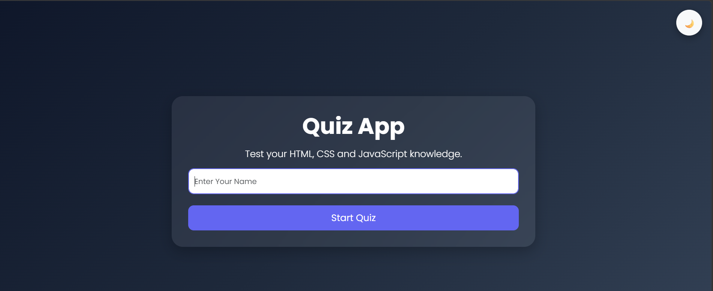
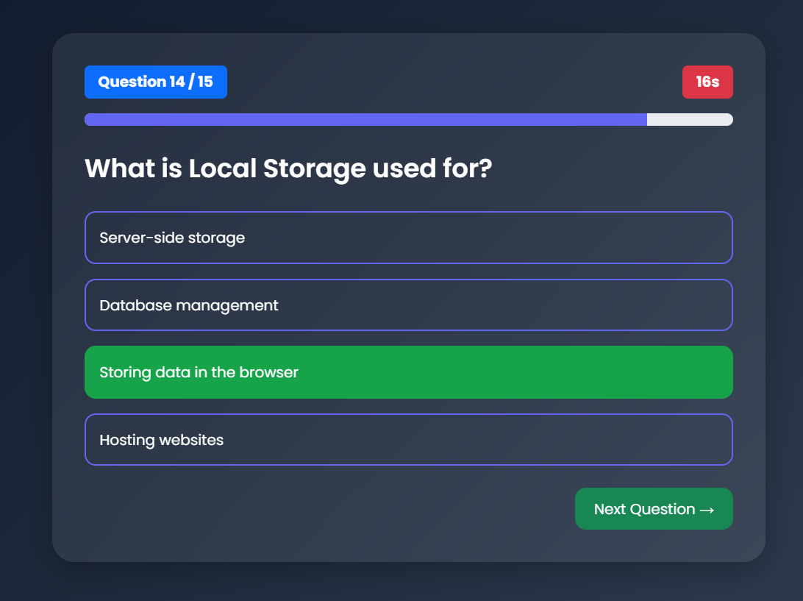
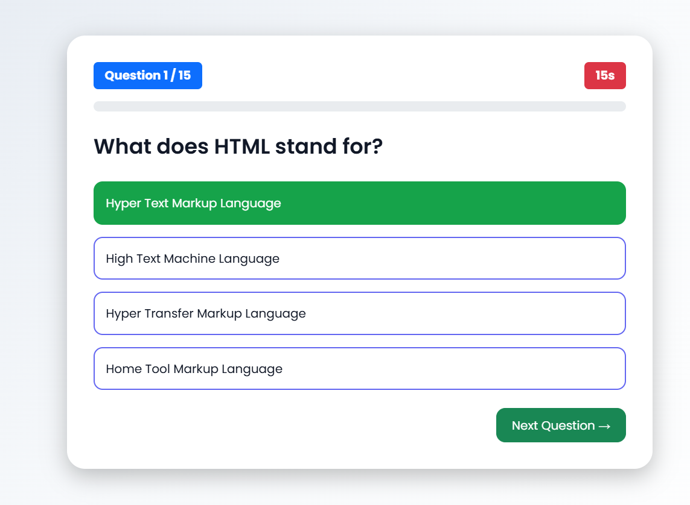
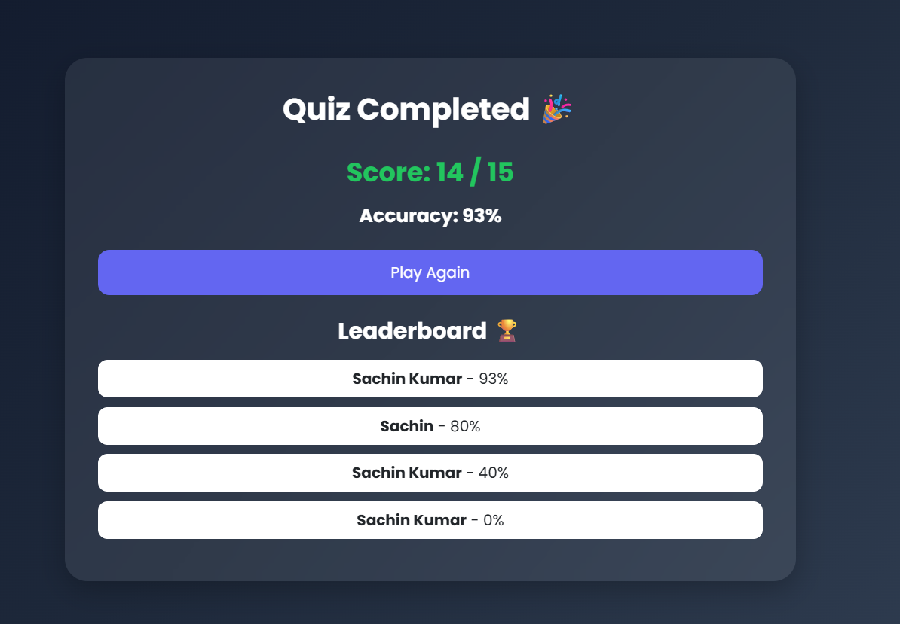

# 🎯 Interactive Quiz App

A modern and responsive Quiz Application built using HTML5, CSS3, JavaScript (ES6+), and Bootstrap 5. The application provides an engaging quiz experience with real-time scoring, timer functionality, progress tracking, dark mode, and a local leaderboard.

## 🚀 Live Demo

Add your deployed link here:

```text
https://sachin197-creator.github.io/Quiz-App-Project/
```

---

## 📌 Features

- ✅ Interactive Multiple Choice Questions
- ✅ Real-Time Score Calculation
- ✅ 30-Second Timer for Each Question
- ✅ Progress Bar Tracking
- ✅ Question Counter
- ✅ Dark/Light Mode Toggle
- ✅ Leaderboard using Local Storage
- ✅ Responsive Design for Mobile & Desktop
- ✅ Restart Quiz Functionality
- ✅ Modern UI with Bootstrap 5

---

## 🛠️ Technologies Used

- HTML5
- CSS3
- JavaScript (ES6+)
- Bootstrap 5
- Local Storage API

---

## 📂 Project Structure

```text
Quiz-App/
│
├── index.html
│
├── css/
│   └── style.css
│
├── js/
│   ├── app.js
│   └── questions.js
│
└── README.md
```

---

## ⚙️ How to Run Locally

1. Open the project folder

```bash
cd quiz-app
```

2. Open `index.html` in your browser

OR

3. Run using VS Code Live Server Extension

---

##  How It Works

1. Enter your name.
2. Click **Start Quiz**.
3. Answer the multiple-choice questions.
4. Track your progress using the progress bar.
5. Complete the quiz before the timer expires.
6. View your score and accuracy.
7. Check your ranking in the leaderboard.
8. Restart and play again.

---

## 📸 Screenshots

### Home Screen



### Quiz Screen



### Quiz Screen



### Leaderboard



---


## 👨‍💻 Author

**Sachin Kumar**

BCA Student | Web Development Enthusiast

---

